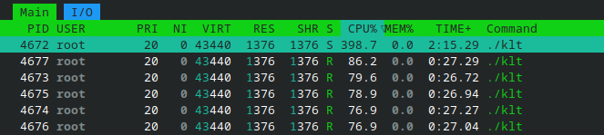
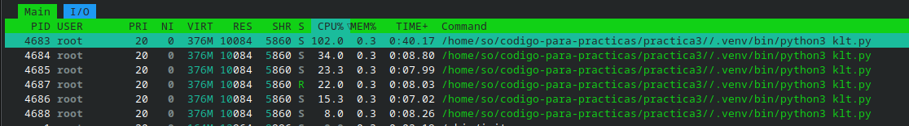
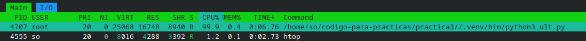
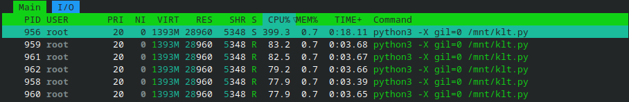
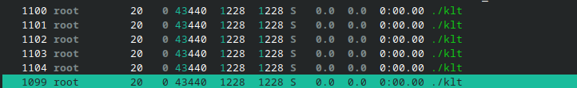
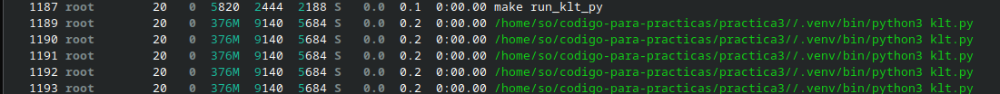

# Sistemas Operativos Práctica 3

## Threading (ULT y KLT)

## Conceptos generales

### 1. ¿Cuál es la diferencia fundamental entre un proceso y un thread?

Los procesos son programas en ejecución. Cada uno posee su propio espacio de direcciones, punteros a los recursos asignados (stacks, archivos) y estructuras asociadas (PCB, tablas de páginas). Se los conoce como la unidad de **propiedad de recursos**.
Para cambiar el proceso que se ejecuta en la CPU debe realizarse un context switch.

Un hilo se conoce como un proceso ligero. El hilo es la **unidad básica de utilización de la CPU** (unidad de ejecución). Cada uno posee su estado de ejecución, su contexto de procesador, stack (de usuario y supervisor), almacenamiento para variables locales y acceso a memoria y recursos del proceso. Sin embargo, se ejecuta dentro del mismo espacio de direcciones que el proceso que lo creó y comparte sus recursos (archivos abiertos, parte del ćodigo y datos). Estos recursos son compartidos entre todos los hilos del proceso.
Los hilos de un proceso comparten estado y recursos del sistema, residiendo en el mismo espacio de direcciones y accediendo a los mismos datos.


Principales diferencias:

- Cada hilo posee su propio program counter, conjunto de registros y espacio de stack. Además, cada uno posee su TCB (thread control block). Por otro lado, los procesos poseen espacio de direcciones distintos, PCB, PC, etc. La creación y destrucción de los hilos es más ligera, pues cuenta con menos estructuras propias.

- Para cambiar el thread en ejecución entre hilos de un mismo proceso no es necesaria la participación del SO (al menos en los User-level threads). Con procesos es necesario realizar context switch llevados a cabo mediante interrupciones al Kernel.

- La planificación de los procesos es llevada a cabo por el SO, mientras que la de los hilos es gestionada por el programador.

- La protección de los recursos de los procesos está garantizada por el SO. En los hilos queda a cargo del desarrollador, ya que hilos de un mismo proceso comparten espacio de direcciones.

### 2. ¿Qué son los User-Level Threads (ULT) y cómo se diferencian de los Kernel-Level Threads (KLT)?

Los ULT (User-Level Threads) son hilos en los que la administración de los mismos es llevada a cabo por la aplicación de usuario, sin intervención del kernel, mediante una librería y sus funciones. El kernel se abstrae de la existencia de estos (no conoce su existencia) y ve únicamente procesos. La creación y operaciones se hacen a nivel de usuario, lo que aumenta la performance.

Ventajas:

- No interviene el kernel en el intercambio entre hilos (las estructuras residen en el espacio de direcciones del proceso).
- La planificación de los hilos la define el programador, sin intervención del kernel.
- Se pueden ejecutar en cualquier SO, ya que no dependen de él.

Desventajas:

- Los hilos no son independientes entre ellos. Pueden acceder a cualquier dirección dentro del proceso, sin protección implícita.
- La suspensión de un hilo (ej.: ante system call) bloquea a todo el proceso (todos los demás hilos).
- Dado que en ambientes multiprocesador cada unidad ejecuta un proceso, los hilos de un proceso deben ejecutarse en la misma CPU (no hay paralelismo).

Los KLT son los hilos que el SO conoce y gestiona (controla su creación, planificación y destrucción). La aplicación puede administrar el hilo a través de una API (existen system calls específicas para los hilos).
El Kernel mantiene información del proceso y cada hilo de este.

### 3. ¿Quién es responsable de la planificación de los ULT? ¿y los KLT? ¿Cómo afecta esto al rendimiento en sistemas con múltiples núcleos?

Los ULT son planificados por la aplicación usuario (el desarrollador), permitiendo definir esquemas de planificación distintas a las del SO. Los KLT son planificados por el Kernel, por lo que siguen el esquema que este dispone para el scheduling de procesos.
Dado que los ULT son transparentes para el Kernel, los hilos de un proceso solo pueden ejecutarse en la misma unidad de procesamiento en la que reside su proceso. Por lo tanto, con ULTs no se puede explotar el paralelismo.

Los KLT son la unidad de ejecución, hilos que el SO conoce. El Kernel es el responsable de su planificación, según el algoritmo que emplee para el scheduling. Al ser entidades reconocidas por el Kernel y utilizadas como unidad de ejecución, pueden ocupar distintas unidades de procesamiento de forma simultánea, lo que permite la ejecución paralela de los hilos.

### 4. ¿Cómo maneja el sistema operativo los KLT y en qué se diferencian de los procesos?

A pesar de que tanto los KLT como los procesos son conocidos y administrados por el Kernel, los hilos siguen presentando los mismos beneficios antes descritos. Dado que los hilos de un proceso comparten acceso a la memoria y recursos del mismo, la comunicación entre ellos es más eficiente, y resulta más rápido crearlos y destruirlos.
Tener varios hilos por proceso permite realizar varias tareas del mismo en simultáneo, permitiendo aprovechar arquitecturas multiprocesador, de forma eficiente.

Como se indicó antes, el Kernel mantiene información del proceso y cada hilo del mismo. El Kernel realiza la planifación en base a los hilos. Es la **unidad básica de ejecución**.

Dado que existen sistemas que proveen tanto KLT como ULT, existen distintas formas de mapear unos a otros:

> Modelo varios a uno

Se mapean varios ULTs a un KLTs. Las operaciones de los hilos de usuario se hacen en el espacio de la aplicación, pero acceden al Kernel de a un hilo. Si uno se bloquea, todo el proceso lo hace. No permite explotar el paralelismo, ya que el Kernel ve a todos los ULT como uno solo.

> Modelo uno a uno

Cada ULT se relaciona con un KLT. Si un hilo de bloquea, otro hilo del mismo proceso puede seguir ejecutándose. Permite explotar el paralelismo, pero dado que la creación de un ULT conlleva a crear un KLT, es bastante costoso y no aprovecha las ventajas de los hilos a nivel usuario.

> Modelo varios a varios

Multiplexa muchos ULTs con una cantidad menor o igual de KLTs. Se pueden crear tantos ULTs como se requieran y serán mapeados a KLTs, que son generados en una cantidad razonable.
Reduce los costos de creación del modelo uno a uno manteniendo la explotación del paralelismo y mitigando lo máximo posible el problema de bloqueo de los hilos del modelo varios a uno.

### 5. ¿Qué ventajas tienen los KLT sobre los ULT? ¿Cuáles son sus desventajas?

Como ventaja encontramos que, en un ambiente multiprocesador, KLTs de un mismo proceso pueden estar ejecutándose paralelamente en las distintas unidades de procesamiento (la unidad de asignación ya no es el proceso). Además, la suspensión de un hilo no bloquea a los demás del mismo proceso.
Como desventaja, tenemos que el cambio de control de la CPU de los hilos de un mismo proceso necesita de un cambio de modo (usuario a Kernel). Por lo tanto, la creación y administración de los KLTs es más lenta que la de los ULTs.

### 6. Qué retornan las siguientes funciones:

*a. getpid()*

Retorna el PID del proceso actual.

*b. getppid()*

Retorna el PID del proceso padre del actual.

*c. gettid()*

Retorna el ID del thread actual. Si es un ambiente single-threaded, coincide con el PID del proceso.

*d. pthread_self()*

Retorna el ID del thread actual a nivel Pthreads (el asignado cuando se llamó a pthread_create). Pthreads es una librería que permite crear KLTs.

*e. pth_self()*

Retorna el ID del thread actual a nivel GNU Pth (librería para crear ULTs).

### 7. ¿Qué mecanismos de sincronización se pueden usar? ¿Es necesario usar mecanismos de sincronización si se usan ULT?

Para memoria compartida se pueden utilizar mecanismos para la gestión de la concurrencia como semáforos, barreras, mutex, condicionales.
A nivel archivos, pueden utilizarse E/S sincrónicas con bloqueos de lectura/escritura.
El objetivo es garantizar la sincronización por exclusión mutua y condición.

Tanto los ULTs como KLTs de un mismo proceso comparten espacio de direcciones, por lo que para mantener la consistencia de los datos, es necesario acceder a los recursos compartidos de forma sincronizada. Para ambos es necesario utilizar mecanismos de sincronización.

### 8. Procesos

*a. ¿Qué utilidad tiene ejecutar fork() sin ejecutar exec()?*

La syscall `fork()` crea un nuevo proceso que comparte las páginas del padre, retornando 0 en el hijo y el PID del hijo en el padre. Si se escribe alguna de las páginas en el hijo, por la política Copy On Write, se duplica esa página, con los nuevos contenidos para el hijo.

Es útil si se quiere que dos procesos ejecuten el mismo código, sin interferir con el otro (debido al COW).

*b. ¿Qué utilidad tiene ejecutar fork() + exec()?*

`exec()` es una system call que permite ejecutar un nuevo programa en el proceso actual, reemplazando las páginas en el proceso.

La combinación `fork()` + `exec()` permite crear un nuevo proceso idéntico al padre y reemplazar el programa en ejecución por otro. En síntesis, permite ejecutar un nuevo programa.

*c. ¿Cuál de las 2 asigna un nuevo PID fork() o exec()?*

La syscall `fork()` asigna un nuevo PID al proceso hijo.

*d. ¿Qué implica el uso de Copy-On-Write (COW) cuando se hace fork()?*

Como se explicó anteriormente, Copy-On-Write permite que un proceso creado por `fork()` posea las mismas páginas que su padre hasta que haya alguna modificación, momento en que la misma se duplica. Esta técnica permite evitar duplicar recursos hasta que verdaderamente sea necesario hacerlo.

*e. ¿Qué consecuencias tiene no hacer wait() sobre un proceso hijo?*

La syscall `wait()` permite esperar la finalización de cualquier hijo. El proceso se bloquea hasta que un hijo termine. No hacerlo puede producir **procesos zombie**. Estos son procesos que **han finalizado** su ejecución pero aun se encuentran en la tabla de procesos, porque su proceso padre no ha leído su exit status. No consume recursos del sistema como CPU o memoria (exceptuando buffers o su entrada en la tabla), pero ocupa un espacio en la tabla de procesos. Esto a la larga puede producir que no se puedan crear nuevos procesos debido a que tabla se llenó.
Permanecen en la tabla para que el padre pueda obtener información sobre ellos y, en particular, leer su exit status.

En definitiva, un proceso zombie se produce cuando un proceso hijo termina pero el proceso padre no ha llamado a `wait()` o `waitpid()` (para un hijo específico) para leer su status.
Si un padre termina, los procesos zombies existentes son adoptados por el proceso `init` por defecto.

*f. ¿Quién tendrá la responsabilidad de hacer el wait() si el proceso padre termina sin hacer wait()?*

Los procesos zombie cuyos padres terminaron sin hacer `wait()` son adoptados por `init()`. Este ejecuta `wait()` periodicamente, permitiendo que el proceso zombie sea desalocado de la tabla.

### 9. Kernel Level Threads

*a. ¿Qué elementos del espacio de direcciones comparten los threads creados con pthread_create()?*

Los threads creados comparten código, datos y heap, pero cada hilo tiene su propio stack.

*b. ¿Qué relaciones hay entre getpid() y gettid() en los KLT?*

`getpid()` retorna el PID del proceso mientras `gettid()` devuelve el ID del thread actual. En procesos single-threaded, el PID coincide con el TID. En procesos con múltiples hilos, todos ellos comparten PID pero difieren en TID.

*c. ¿Por qué pthread_join() es importante en programas que usan múltiples hilos? ¿Cuándo se liberan los recursos de un hilo zombie?*

`pthread_join()` permite realizar un wait sobre un thread específico para esperar por su finalización. Si no se hiciera join sobre un hilo en el que debe realizarse dicha operación y este termina, quedaría como hilo zombie. Los recursos de un thread zombie se liberan al terminar el proceso que lo creó.

*d. ¿Qué pasaría si un hilo del proceso bloquea en read()? ¿Afecta a los demás hilos?*

No. Debido a que los KLTs son las unidades de ejecución y son conocidos por el Kernel, estos pueden ejecutarse paralelamente. Si un hilo se bloquea, los demás pueden continuar su ejecución.

*e. Describí qué ocurre a nivel de sistema operativo cuando se invoca pthread_create() (¿es syscall? ¿usa clone?).*

`pthread_create()` no es una syscall, pero usa la syscall `clone()` por debajo.

`pthread_create()` es una función de biblioteca. Es invocada desde el espacio de direcciones del usuario. Primeramente, la biblioteca realiza tareas como asignar el stack de cada hilo (para variables locales de cada hilo), organiza estructuras de datos necesarias y registra el hilo para poder ejecutar funciones posteriores como `pthread_join()`.
Luego de esto, con el fin de crear un KLT, la biblioteca invoca la syscall `clone()`. Tanto procesos como hilos están unificados bajo la estructura `task_struct`. El scheduler de Linux planifica tasks, por lo que la diferencia entre proceso e hilo radica en los recursos que comparten.
A la syscall `clone()` se le pasa una serie de flags para definir los recursos a compartir (evitando que se comporte como `fork()`, que crea un proceso independiente).

Cuando se llama a `clone()`, se crea una nueva `task_struct`, enlaza punteros con las tablas de página (en lugar de duplicarlas) e inserta la task en la cola de ejecución, para competir por la CPU.

### 10. User Level Threads

*a. ¿Por qué los ULTs no se pueden ejecutar en paralelo sobre múltiples núcleos?*

Esto se debe a que estos son creados y administrados por la aplicación de usuario, pero el Kernel no los conoce. Este ve y planifica únicamente procesos. Por ello, aunque son ligeros en cuestión de costo de creación y permiten flexibilidad en la planificación, al no ser estructuras conocidas por el Kernel, no pueden utilizarse como unidades de ejecución para explotar el paralelismo.

*b. ¿Qué ventajas tiene el uso de ULTs respecto de los KLTs?*

Las ventajas ya fueron mencionadas anteriormente. Principalmente son:

- No intervención del Kernel en el intercambio de hilos en ejecución (todos comparten el mismo espacio).
- Flexibilidad para que el usuario desarrollador defina como planificar los hilos.
- Pueden ejecutarse en cualquier SO, ya que no dependen de él.

*c. ¿Qué relaciones hay entre getpid(), gettid() y pth_self() (en GNU Pth)?*

`getpid()` retorna el PID del proceso actual. `gettid()` retorna el TID del hilo actual a nivel Kernel (en single-threaded coincide con el PID). `pth_self()` retorna el ID del thread actual a nivel de la librería GNU Pth.

*d. ¿Qué pasaría si un ULT realiza una syscall bloqueante como read()?*

Si no se tienen KLTs, todos los ULTs son agrupados y planificados bajo el proceso que lo creó. El bloque de un hilo produce el bloqueo de todo el proceso, es decir, de todos los demás hilos.

*e. ¿Qué tipos de scheduling pueden tener los ULTs? ¿Cuál es el más común?*

El scheduling de los ULTs puede ser definido por el programador, aun si la planificación difiere de la que usa el Kernel para los procesos. Podría usarse Round Robin, prioridades, etc.

Suele utilizarse el `SCHED_OTHER`, que es la política de planificación por defecto de los procesos de usuario en Linux. Su principal objetivo es asegurar el fairness en la ejecución, asignando porciones de tiempo variables a cada proceso para mantener el tiempo de cada uno de forma lo más equitativa posible.

### 11. Global Interpreter Lock

*a. ¿Qué es el GIL (Global Interpreter Lock)? ¿Qué impacto tiene sobre programas multi-thread en Python y Ruby?*

El GIL es un mecanismo de sincronización por exclusión mutua que utilizan algunos lenguajes interpretados para asegurar que solo un hilo en ejecución pueda ejecutar código del lenguaje a la vez por cada proceso.
Esta idea rompe el paralelismo, ya que deben ejecutarse de a uno, turnándose.

El GIL se creó debido a la gestión de memoria basada en el conteo de referencias que hacían lenguajes como Ruby o Python. Permitir el paralelismo de hilos haría que potencialmente varios hilos puedan modificar este conteo (causando corrupción de datos o fugas de memoria). Para evitarlo, se diseñó un mecanismo para bloquear todo el intérprete.

El impacto en programas multi-threaded depende de si las tareas son CPU-bound o I/O-bound. Para las primeras la performance se degrada inmensamente, ya que prácticamente se ejecuta de forma secuencial. Para aquellas orientas a I/O el impacto es casi nulo, porque cuando un hilo se bloquea por una operación E/S, libera el GIL y otro puede continuar con la ejecución.

En la actualidad, tanto en Python (con CPython como implementación de referencia para el lenguaje) como Ruby (CRuby), poseen distintos mecanismos para intentar solventar estas problemáticas

*b. ¿Por qué en CPython o MRI se recomienda usar procesos en vez de hilos para tareas intensivas en CPU?*

CPython y MRI son implementaciones concretas de los lenguajes Pyhton y Ruby, que sirven como referencia al ser las oficiales. Python es una definición del lenguaje meintras que CPython es el software real que lee el código, lo traduce a código máquina y lo ejecuta.

A pesar de que los procesos consuman más recursos y sean más costosos de crear, en CPyhton o MRI son mejor alternativa para tareas CPU-bound, ya que permiten paralelismo real. Como cada proceso tiene su propio GIL independiente, pueden ejecutarse simultáneamente.

Para tareas I/O-bound los hilos siguen siendo mejor alternativa, ya que que ante bloqueo el GIL se libera y puede ejecutarse otro. Puede aprovecharse los beneficios de la ligereza de los hilos.

## Práctica guiada

### 1. Instale las dependencias necesarias para la práctica (`strace`, `git`, `gcc`, `make`, `libc6-dev`, `libpth-dev`, `python3`, `htop` y `podman`):

```bash
apt update
apt install build-essential libpth-dev python3 python3-venv strace git htop podman
```

### 2. Clone el repositorio con el código a usar en la práctica

`git clone https://gitlab.com/unlp-so/codigo-para-practicas.git`

### 3. Resuelva y responda utilizando el contenido del directorio practica3/01-strace:

**a. Compile los 3 programas C usando el comando make.**

**b. Ejecute cada programa individualmente, observe las diferencias y similitudes del PID y THREAD_ID en cada caso. Conteste en qué mecanismo de concurrencia las distintas tareas:**

*i. Comparten el mismo PID y THREAD_ID*

```
03-ul-thread 
Parent process: PID = 4132, THREAD_ID = 4132, PTH_ID = 94760210499824
Child thread: PID = 4132, THREAD_ID = 4132, PTH_ID = 94760210502368
```

Dado que se crean ULTs con GNU Pth, para el Kernel todo ocurre dentro de una única tarea (un solo proceso). No sabe de la existencia de hilos y, por lo tanto, ambos poseen el mismo PID y TID. Sin embargo, el ID dado por la librería si es distinto, pues esta es capaz de diferenciar ambos.

*ii. Comparten el mismo PID pero con diferente THREAD_ID*

```
02-kl-thread 
Parent process: PID = 4130, THREAD_ID = 4130
Child thread: PID = 4130, THREAD_ID = 4131
```

Aquí se usa `pthreads` para crear un hilo a partir de un mismo proceso con un hilo master. Se tiene un solo proceso y dos KLTs. Por eso el PID es el mismo pero el TID varía según el hilo (el hilo master tiene PID = TID). Cada hilo es una entidad de planificación independiente para el Kernel.

*iii. Tienen distinto PID*

```
01-subprocess 
Parent process: PID = 4128, THREAD_ID = 4128
Child process: PID = 4129, THREAD_ID = 4129
```

En este caso se utiliza `fork()` para crear un proceso. Por lo tanto, ambos tiene PID distinto. No crean hilos, así que se pueden considerar single-threaded y su PID coincide con su TID.

**c. Ejecute cada programa usando strace (strace ./nombre_programa > /dev/null) y responda:**

*i. ¿En qué casos se invoca a la systemcall clone o clone3 y en cuál no? ¿Por qué?*

En la alternativa con `fork()` (`01-subprocess`) se usa clone. En `02-kl-thread` se usa clone3. En `03-ul-thread` no se usa ninguno de los dos.

Para los dos primeros casos se invoca porque el SO necesita crear una nueva estructura `task_struct`. Para crear ULTs no es necesario, ya que es la biblioteca la que maneja la alternancia de hilos en la CPU, sin intervención del Kernel. Por ello, no es necesario una syscall como clone.

*ii. Observe los flags que se pasan al invocar a clone o clone3 y verifique en qué caso se usan los flags CLONE_THREAD y CLONE_VM.*

En `01-subprocess` se utiliza: `clone(child_stack=NULL, flags=CLONE_CHILD_CLEARTID|CLONE_CHILD_SETTID|SIGCHLD, child_tidptr=0x7f7b4f04ea10) = 4419`.

En `02-kl-thread` se invoca: `clone3({flags=CLONE_VM|CLONE_FS|CLONE_FILES|CLONE_SIGHAND|CLONE_THREAD|CLONE_SYSVSEM|CLONE_SETTLS|CLONE_PARENT_SETTID|CLONE_CHILD_CLEARTID, child_tid=0x7f3fdfd61990, parent_tid=0x7f3fdfd61990, exit_signal=0, stack=0x7f3fdf561000, stack_size=0x7fff80, tls=0x7f3fdfd616c0} => {parent_tid=[4426]}, 88) = 4426`

Los flags `CLONE_THREAD` y `CLONE_VM` se utilizan en la creación de los KLTs.

*iii. Investigue qué significan los flags CLONE_THREAD y CLONE_VM usando la manpage de clone y explique cómo se relacionan con las diferencias entre procesos e hilos.*

Si se utiliza `CLONE_THREAD`, el hijo creado es ubicado en el mismo grupo de threads que el proceso llamador. Estos grupos vinculan un conjunto de threads que comparten PID (considerado thread group identifier) pero se distinguen por su TID. Si no se usa el flag, el nuevo thread es ubicado en un nuevo grupo de threads donde es el líder y el TGID es su TID. En definitiva, permite crear un hilo y asignarlo al conjunto de threads del proceso llamador.

Indicar `CLONE_VM` determina que el proceso llamador y el hijo clonado comparten el mismo espacio de memoria. Cualquier escritura realizada por alguno de ellos será visible para todos los que compartan dicho espacio. Si no se usa este flag, entonces el proceso hijo corre en una copia separada del espacio de direcciones y las escrituras no afectan a los demás.

Usar ambos flags en conjunto permite agrupar el nuevo proceso en un mismo grupo de threads (comparten PID, difieren en TID) y asignar el mismo espacio de direcciones del padre. De esta forma, se crea un Kernel Level Thread.

*iv. printf() eventualmente invoca la syscall write (con primer argumento 1, indicando que el file descriptor donde se escribirá el texto es STDOUT). Vea la salida de strace y verifique qué invocaciones a write(1, ...) ocurren en cada caso.*

Para `01-subprocess` se invoca `write(1, "Parent process: PID = 4435, THRE"..., 45) = 45`

Para `02-klt-thread` se llama `write(1, "Parent process: PID = 4445, THRE"..., 45) = 45`

En `03-ul-thread` se hace lo propio con `write(1, "Parent process: PID = 4451, THRE"..., 70) = 70` y `write(1, "Child thread: PID = 4451, THREAD"..., 68) = 68`

Al redirigir a `/dev/null`, `strace` solo intercepta las syscalls del proceso principal. Por ello, en las dos primeras alternativas solo se ve el write del proceso padre o hilo master.
En el programa que crea un ULT se pueden ver ambos write, ya que todo ocurre dentro del mismo proceso usuario para el Kernel. Todos los write de todos los hilos son invocados por el proceso que `strace` monitorea.

*v. Pruebe invocar de nuevo strace con la opción -f y vea qué sucede respecto a las invocaciones a write(1, …). Investigue qué es esa opción en la manpage de strace. ¿Por qué en el caso del ULT se puede ver la invocación a write(1, …) por parte del thread hijo aún sin usar -f?*

Al usar `-f` (`--follow-forks`) pueden verse ambos write en todos los programas. Este flag permite monitorear a todos los procesos que sean creados con fork o clone por el proceso principal monitoreado.

En el caso del ULT ya podían verse por lo mencionado en el inciso anterior.

### 4. Resuelva y responda utilizando el contenido del directorio practica3 02-memory:

**a. Compile los 3 programas C usando el comando make.**

**b. Ejecute los 3 programas.**

**c. Observe qué pasa con la modificación a la variable number en cada caso. ¿Por qué suceden cosas distintas en cada caso?**

```
01-subprocess

Parent process: PID = 4527, THREAD_ID = 4527
Parent process: number = 42
Child process: PID = 4528, THREAD_ID = 4528
Child process: number = 84
Parent process: number = 42


02-kl-thread

Parent process: PID = 4530, THREAD_ID = 4530
Parent process: number = 42
Child thread: PID = 4530, THREAD_ID = 4531
Child process: number = 84
Parent process: number = 84

03-ul-thread

Parent process: PID = 4533, THREAD_ID = 4533, PTH_ID = 94729891199216
Parent process: number = 42
Child thread: PID = 4533, THREAD_ID = 4533, PTH_ID = 94729891201760
Child thread: number = 84
Parent process: number = 84
```

En el primer caso, ambos procesos comparten espacio de direcciones en un primer momento pero se utiliza la técnica COW. Cuando el proceso hijo modifica number, se duplica esa página. Parent sigue teniendo el anterior valor porque el number modificado es el que reside en el espacio de direcciones de Child.

En el segundo caso y tercer caso, dado que los hilos comparten el espacio de direcciones del hilo master que los creó, las modificaciones en las variables globales afectan a todos los hilos del proceso.

### 5. El directorio practica3/03-cpu-bound contiene programas en C y en Python que ejecutan una tarea CPU-Bound (calcular el enésimo número primo).

**a. Ejecute htop en una terminal separada para monitorear el uso de CPU en los siguientes incisos.**

**b. Ejecute los distintos ejemplos con make (usar make help para ver cómo) y observe cómo aparecen los resultados, cuánto tarda cada thread y cuanto tarda el programa completo en finalizar.**

> klt.c



`All threads are done in 44.579421 seconds`. Se crearon 5 threads, que pueden observarse en `htop`. Se ejecutaron en paralelo.

> ult.c


`All threads are done in 167.000000 seconds`. Se crearon 5 threads, pero debido a que son ULT, el Kernel solo conoce el proceso principal (que es lo que se ve en `htop`). Además, debido a eso, no pueden ejecutarse en paralelo. Cada hilo tardó aproximadamente `33 seconds`, pero al ejecutarse uno luego del otro el tiempo total es considerablemente mayor que el de la opción con KLTs.

> klt.py



`All threads are done in 416.5124509334564 seconds`. Se crearon 5 threads. Si bien son reconocidos por el Kernel y podrían ejecutarse en paralelo, en la salida de htop se observa que solo uno está en Running mientras los demás están Sleeping. Esto se debe al GIL antes mencionado, que bloquea el intérprete para mantener la consistencia en el conteo de referencias. Por lo tanto, no hay paralelismo entre los threads.

> ult.py



`All greenlets are done in 226.92710995674133 seconds`. Se crearon 5 threads, pero al ser ULTs sucede lo mismo que se indicó en `ult.c`. Acá el GIL no tiene gran incidencia porque no hay posibilidad de paralelismo.

> klt_py_nogil



`All threads are done in 120.16964411735535 seconds`. Se crearon 5 threads. Al desactivar el GIL, pueden ejecutarse los KLTs paralelamente, alcanzando un rendimiento superior que si se lo tiene activo. De todos modos, es más lento que en C.

La verisón `klt_py_nogil` no funciona, pero debería ser similar a `klt.c`, ya que se crean KLTs y se desactiva el GIL.

**c. ¿Cuántos threads se crean en cada caso?**

Se configuran 5 threads para cada programa.

**d. ¿Cómo se comparan los tiempos de ejecución de los programas escritos en C (ult y klt)?**

Con KLTs hay paralelismo real, por lo que es el algoritmo más rápido. Con ULTs, aunque cada hilo es más rápido, el tiempo total del programa es mayor porque no se ejecutan al mismo tiempo. 

**e. ¿Cómo se comparan los tiempos de ejecución de los programas escritos en Python (ult.py y klt.py)?**

Si bien ambos se ven afectados por el GIL, la alternativa `klt.py` es considerablemente más lenta debido al overhead introducido por la creación de hilos a nivel SO. Para este programa, se crean 5 hilos que compiten constantemente por acceso a una unidad de procesamiento. Sin embargo, dado que solo una posee el GIL desbloqueado, la mayoría al ingresar a la CPU no puede ejecutarse y termina saliendo. Esta planificación de tareas en las que solo una puede estar operativa simultáneamente introduce un gran overhead, considerando además también la sobrecarga de los sucesivos context switches.

**f. Modifique la cantidad de threads en los scripts Python con la variable NUM_THREADS para que en ambos casos se creen solamente 2 threads, vuelva a ejecutar y comparar los tiempos. ¿Nota algún cambio? ¿A qué se debe?**

> klt.py

`All threads are done in 122.182373046875 seconds`.

> ult.py

`All greenlets are done in 69.55149722099304 seconds`

> klt_py_nogil

`All threads are done in 59.68402099609375 seconds`

Al reducir la cantidad de threads, el tiempo total del programa se reduce ya que hay menos trabajo distribuido y cada hilo puede aprovechar mejor su tiempo de CPU. Dado que con GIL no hay paralelismo real, no resulta beneficioso aumentar la cantidad de hilos.

Sin embargo, la alternativa sin GIL también mejoró su rendimiento. Esto está vinculado con el hecho de que la máquina virtual tiene asignados dos cores, por lo que tener 2 threads permite que ambos se ejecuten simultáneamente. Tener 5 threads con 2 cores no permite aprovechar los beneficios del paralelismo y merma el rendimiento por los context switches.

**g. ¿Qué conclusión puede sacar respecto a los ULT en tareas CPU-Bound?**

No son especialmente útiles para tareas que demandan CPU sin ser mapeados a KLTs, ya que no permiten aprovechar el paralelismo. En definitiva, solo provee una solución concurrente en una única unidad de procesamiento.
Para tareas CPU-Bound es recomendable explotar el paralelismo, por lo que las alternativas de Python con GIL tampoco son óptimas.

### 6. El directorio practica3/04-io-bound contiene programas en C y en Python que ejecutan una tarea que simula ser IO-Bound (tiene una llamada a sleep lo que permite interleaving de forma similar al uso de IO).

**a. Ejecute htop en una terminal separada para monitorear el uso de CPU en los siguientes incisos.**

**b. Ejecute los distintos ejemplos con make (usar make help para ver cómo) y observe cómo aparecen los resultados, cuánto tarda cada thread y cuanto tarda el programa completo en finalizar.**

> klt.c



`All threads are done in 10.000783 seconds`. Se observa como los 5 threads están dormidos.

> ult.c


`All threads are done in 10.010350 seconds`. La única tarea reconocida por el Kernel se encuentra en estado Sleeping.

> klt.py



`All threads are done in 10.013232946395874 seconds`. Las 5 tareas se encuentran dormidas.

> ult.py


`All greenlets are done in 10.015408039093018 seconds`. La tarea reconocida por el SO está en estado Sleeping.

**c. ¿Cómo se comparan los tiempos de ejecución de los programas escritos en C (ult y klt)?**

Los tiempos son similares. En teoría `klt.c` puede atender todos los requisitos I/O simulatáneamente, pues el bloqueo de un hilo no suspende a otro. Por otro lado, `ult.c` resultaría más lento, ya que cada bloqueo suspende a todos los demás hilos, que deben atender uno después del otro la operación I/O.

Sin embargo, ambos tardan lo mismo. Esto puede deberse a optimizaciones de la librería, la cuál detecta las funciones bloqueantes e introduce optimizaciones para que la espera se realice de forma simultánea. Modifiqué el código para que un hilo espere más que los demás y el tiempo total del programa se correspondió con dicho valor. Esto implica que no se ejecuta uno después del otro, sumando sus tiempos, sino que la librería de alguna forma permite que el bloqueo no afecte a todos los hilos. 

**d. ¿Cómo se comparan los tiempos de ejecución de los programas escritos en Python (ult.py y klt.py)?**

Sucede algo similar que con los programas en C. Aunque en teoría la versión con KLTs debería ser más rápida, por poder efectuar en simultáneo las operaciones I/O, la optimización de las librerías para crear ULTs permite que el bloqueo de un hilo no suspenda a todos los demás. Debido a eso, los tiempos coinciden.

**e. ¿Qué conclusión puede sacar respecto a los ULT en tareas IO-Bound?**

Aunque a priori parecería que los ULTs son ineficientes para tareas I/O-bound, debido al bloqueo de todos los hilos, la optimización de la librería permite que sea igual de performante que la versión con KLTs.
Las librerías son capaces de interceptar llamadas bloqueantes del SO y transformarlas en llamadas no bloqueantes (asincrónicas).

### 7. Diríjase nuevamente en la terminal a practica3/03-cpu-bound y modifique klt.py de forma que vuelva a crear 5 threads.

**a. Ejecute htop en una terminal separada para monitorear el uso de CPU en los siguientes incisos.**

**b. Ejecute una versión de Python que tenga el GIL deshabilitado usando: `make run_klt_py_nogil` (esta operación tarda la primera vez ya que necesita descargar un container con una versión de Python compilada explícitamente con el GIL deshabilitado).**

**c. ¿Cómo se comparan los tiempos de ejecución de klt.py usando la versión normal de Python en contraste con la versión sin GIL?**

El análisis se hizo en el inciso 5. La versión `klt.py` sin GIL es ampliamente superior, ya que tarda casi 4 veces menos que aquella que lo tiene activado. 

**d. ¿Qué conclusión puede sacar respecto a los KLT con el GIL de Python en tareas CPU-Bound?**

La reducción de performance en los KLTs generados en Python no se relaciona con una restricción del Kernel, sino con la limitación impuesta por el GIL en el caso concreto de Python. Removerlo permite recuperar la capacidad de explotar el paralelismo de los hilos. Sin embargo, sigue siendo inferior a la versión de C según los experimentos realizados.