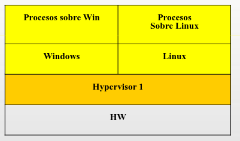
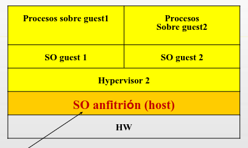
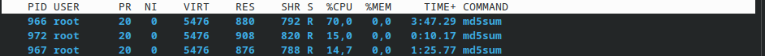

# Sistemas Operativos Práctica 4A

## cgroups & namespaces

## Parte 1: Conceptos teóricos

### 1. Defina virtualización. Investigue cuál fue la primera implementación que se realizó.

La virtualización es una técnica que permite introducir una capa de abstracción de los recursos del hardware de una computadora. Permite ocultar detalles técnicos a través de la encapsulación y desacoplar el hardware del software. Permite, entre otras cosas, que una computadora pueda realizar el trabajo de varias a través de la compartición de recursos de un único dispositivo de hardware.

La virtualización puede ser a nivel:

- Procesos: portabilidad entre distintos sistemas (ej.: JVM).
- Storage: vista lógica del almacenamiento.
- Network
- Sistema Operativo: SO permite la existencia de varias instancias de espacio de usuario aisladas (contenedores).
- Sistema: creación de máquinas virtuales.

Algunos motivos para virtualizar pueden ser:

- Ejecutar software hecho para otro sistema operativo.
- Ejecutar múltiples instancias de sistemas operativos.
- Ejecutar una aplicación de forma aislada.
- Aprovechar recursos de una computadora.
- Fácilidad de migración

La primera implementanción de virtualización fue desarrollada por IBM a mediados de la década de 1960 con el sistema CP-40. Este sistema permitía correr múltiples instancias de sistemas operativos cliente sobre mainframes. Su versión comercial fue el CP-67, lanzado para la mainframe System/360-67.

### 2. ¿Qué diferencia existe entre virtualización y emulación?

La virtualización busca aislar y compartir hardware maximizando con la menor penalización de rendimiento posible, mientras que la emulación busca traducir y simular un hardware completamente diferente a nivel software.

> Emulación

El sistema guest está diseñado para una ISA (Instruction Set Architecture) distinta a la del sistema host. El emulador debe actuar como intermediario entre ambos sistemas, interpretando y traduciendo las instrucciones del sistema guest en código que nativo del sistema host.

No se emula únicamente la CPU, sino que mediante software el emulador debe recrear cada registro de estado, interrupción y periférico del sistema original.

Debido a esto, la penalización de rendimiento es muy alta, pues la traducción de todas las instrucciones introduce gran overhead.

> Virtualización

El sistema guest comparte la misma arquitectura de procesador (ISA) que el sistema host. No hay traducción de instrucciones, sino que el gestionador de recursos (VMM o Hipervisor) permite que las instrucciones del sistema guest se ejecuten de forma nativa. Dado que el sistema guest se ejecuta en modo usuario, las instrucciones no privilegiadas se ejecutan directamente, mientras que las privilegiadas provocan una interrupción que delegan su manejo en el VMM o Hipervisor. Se utiliza mecanismo **trap-an-emulate**, donde se hace una interpretación selectiva de las instrucciones que requieren modo privilegiado para ejecutarse.

La penalización de rendimiento es mínima, ya que la mayoría del código se ejecuta directamente sobre la CPU.

### 3. Investigue el concepto de hypervisor y responda:

**(a) ¿Qué es un hypervisor?**

También conocidos como VMM (Virtual Machine Monitor), es una capa de software que separa las aplicaciones de usuario y el SO del hardware subyacente. Provee una plataforma de virtualización que permite múltiples SO corriendo en un host al mismo tiempo.

Entre sus características se destaca:

- Controla los recursos y planificación de los sistemas guest.
- Se ejecuta en modo supervisor.
- Manejan los traps generados por los sistemas guest al ejecutar instrucciones privilegiadas.
- Interpreta dichas instrucciones privilegiadas

**(b) ¿Qué beneficios traen los hypervisors? ¿Cómo se clasifican?**

Sus principales beneficios son:

- Permiten aumento de la eficiencia: los hipervisores habilitan la multiplexación de recursos, permitiendo correr varias máquinas o entornos virtuales de manera aislada, maximizando la carga de trabajo.

- Ejecución aislada y seguridad: cada VM se ejecuta en su propio espacio de direcciones. El hipervisor actúa como mediador entre los sistemas guest y el sistema host. Si una VM falla, el impacto no se propaga a las demás.

- Abstracción de hardware y portabilidad: el hipervisor muestra al sistema guest recursos de hardware virtual estandarizados y genéricos, independientemente de los componentes físicos reales. Esto elimina la dependencia de controladores y permite que la VM sea portable y fácil de migrar.

Se clasifican en hipervisor de tipo 1 e hipervisor de tipo 2:

> Hipervisor de tipo 1

Son bare-metal (se ejecutan directamente sobre el hardware), tomando control total de los recursos del sistema. No requieren sistema operativo subyacente. El hipervisor mismoa ctúa como un "microkernel" especializado en gestionar la virtualización.

- Se ejecuta en modo kernel y cada VM se ejecuta como un proceso en modo usuario.
- El SO guest no requiere ser modificado
- Existe un modo kernel y modo usuario virtual en el SO guest.
- Siempre que la VM ejecuta una instrucción sensible (que cambia el estado de la CPU), se produce trap que procesa el hipervisor.
- Requiere asistencia por hardware.
- Ofrece el mayor rendimiento posible.



> Hipervisor de tipo 2

Se ejecuta como un programa de usuario sobre un sistema operativo host. El hipervisor debe solictar recursos a través del kernel del SO anfitrión.

- Depende de las APIs del SO host para interactuar con el hardware, lo que introduce capas adicionales de traducción de llamadas al sistema.
- Su función principal es interpretar un subconjunto de las instrucciones de hardware de la máquina sobre la que corre.
- Las instrucciones sensibles de los SO guest son sustituidas por llamadas al hipervisor que emulan las instrucciones.



### 4. ¿Qué es la full virtualization? ¿Y la virtualización asistida por hardware?

Los procesadores x86 proveen una protección basada en el concepto de niveles o anillos de privilegio, siendo 0 el anillo de mayor privilegio y 3 el de menor. El software privilegiado se ejecuta en el anillo 0 (kernel mode) y las aplicaciones de usuario en los niveles 1 a 3. El nivel determina si las instrucciones privilegiadas pueden ejecutarse sin generar una excepción.

El problema con la arquitectura x86 es que algunas instrucciones sensibles no son privilegiadas, por lo que no generaban un trap y el hipervisor no podía interceptarlas. Para poder virtualizar correctamente en arquitecturas x86 nacieron estas dos tecnologías.

> Full virtualization

Es una técnica de virtualización que permite simular completamente el hardware subyacente. El hipervisor provee a cada VM con todos los servicios del sistema físico, incluyendo una BIOS virtual, dispositivos virtuales y el manejo de memoria virtual. El SO guest permanece totalmente desacoplado del hardware subyacente por la capa de virtualización.

- Los SO guest deben ejecutar la misma arquitectura de hardware sobre la que corren.
- No requiere que los sistemas guest se modifiquen.
- El VMM analiza el fujo de ejecución de los SO guest. Los bloques que contienen instrucciones sensibles son modificados. Los que contienen instrucciones inocuas se ejecutan directamente sobre el hardware. (técnica binary translation).
- El monitoreo constante de los sistemas guest introduce overhead.

> Virtualización asistida por hardware

Técnica que modifica la arquitectura de la CPU para eliminar la necesidad de traducir el código por software.

Los fabricantes introdujeron una nueva capa debajo de los anillos tradicionales, creando dos modos de ejecución para la CPU:

- VMX Root Operation (Modo Root en Intel): modo en el que se ejecuta el hipervisor. Se ejecuta en el anillo 0 (pero al estar en modo Root, es como si fuera un "anillo -1"). Total control del hardware real.
- VMX Non-Root Operation (Modo Non-Root en Intel): modo en el que se ejecuta la VM. El guest se ejecuta en anillo 0, pero en modo Non-Root.

Cuando el SO guest ejecuta una instrucción privilegiada, el procesador físico la detecta por hardware y realiza una transición llamada VM-Exit, que pausa la VM y transfiere el control al hipervisor en Modo Root. En este punto, el hipervisor procesa la solicitud y realiza los cambios que el SO guest espera en sus recursos virtuales (es decir, evita que modifique el estado del hardware real), para que este pueda obtener la salida que esperaba al ejecutar la instrucción sensible. Finalmente, devuelve el control a la VM con un VM-Entry.

Tanto el SO host como el guest ejecutan en el anillo 0, pero el primero lo hace en Root mode y el otro no. Esto implica que el guest no tiene acceso a todo el hardware, aunque él crea que si.

Mejora el rendimiento al interceptar las instrucciones por hardware.

---

Diferencia de ambas tecnologías con un ejemplo:

- Por Software (Full Virtualization, Traducción Binaria): El hipervisor escanea el código del Guest OS antes de ejecutarlo. Cuando encuentra un `POPF` (*) , lo reemplazaba por código propio que modifica un "registro `EFLAGS` virtual" mantenido en software por el hipervisor.

- Por Hardware (Intel VT-x / AMD-V): Introdujo el modo VMX Non-Root. Cuando la CPU opera en este modo, se modifica el comportamiento del silicio: las instrucciones sensibles no privilegiadas ahora cambian sus reglas y obligatoriamente generan un VM-Exit (un trap de hardware) hacia el Modo Root donde está el hipervisor.

(*) Ejemplo de instrucción sensible que carga flags en la CPU.

### 5. ¿Qué implica la técnica binary translation? ¿Y trap-and-emulate?

> Binary Translation

La técnica de binary translation combina la traducción binaria con la ejecución directa, permitiendo que las instrucciones no sensibles se ejecuten directamente sobre el hardware.
El hipervisor divide el código binario de la VM en bloques de instrucciones antes de su ejecución. Durante la misma, el hipervisor se encuentra continuamente analizando el flujo de ejecución de los SO guest, escaneando las instrucciones una a una. Las instrucciones inocuas son dejadas intactas. Si detecta una instrucción sensible, la intercepta y reemplaza (traduce) por una secuencia de instrucciones seguras que simulen el efecto deseado en el hardware virtual (generalmente una llamada a una función del hipervisor). Los bloques traducidos son alamcenados en caché y se ejecutan directamente en la CPU.

Fue una contramedida para proveer virtualización a la arquitectura x86, la cual no podía utilizar el esquema trap-and-emulate debido a que no todas las instrucciones sensibles son privilegiadas.

> Trap-and-Emulate

Esta estrategia es ideal en arquitecturas que cumplen el teorema de Popek y Goldberg (no aplica a x86 sin asistencia por hardware). El hipervisor se ejecuta con el máximo privilegio del sistema, mientras que el SO guest se ejecuta con un nivel de privilegio menor. Sin embargo, este no es modificado y asume que tiene acceso directo al hardware.

La CPU física ejecuta las instrucciones inocuas de la VM de forma directa, a velocidad nativa, sin intervención del hipervisor. Cuando el SO guest intenta ejecutar una instrucción privilegiada (*), se genera un trap. En este punto, la CPU transifere el control al hipervisor, que determina que instrucción causo el trap y emula el resultado de la misma en una estructura de datos de software que representa el estado de esa VM. Luego, el hipervisor le devuelve el control a esa VM.

(*) El modelo requiere que las instrucciones sensibles sean un subconjunto de las privilegiadas.

### 6. Investigue el concepto de paravirtualización y responda:

**(a) ¿Qué es la paravirtualización?**

Es una técnica de virtualización que requiere modificar los SO guest para mejorar el rendimiento. 
Cuando se quiere ejecutar una instrucción sensible, el SO guest la transforma en una llamada al VMM que expone una API específica. Por lo tanto, el VMM no realiza una traducción binaria completa ni debe emular instrucciones de hardware, lo que simplifica el proceso. El SO guest se comporta como un proceso de usuario que hace llamadas al SO (hipervisor en este caso).

Toda instrucción sensible del guest es eliminada y reemplazada por llamadas a la API especializada del hipervisor. En caso de no eliminar todas las instrucciones sensibles (paravirtualización parcial) el VMM deberá realizar traducción binaria.

La modificación del sistema guest se puede realizar instalando un SO alterado (cuyo kernel fue recompilado) o instalando drivers paravirtualizados (paravirtualización parcial, solo para algunas funciones y dispositivos).

**(b) Mencione algún sistema que implemente paravirtualización.**

Xen Project es un ejemplo de sistema que implementa paravirtualización. Xen es un hipervisor de tipo 1. El sistema operativo de control y las VM invitadas modifican sus kernels para comunicarse directamente con Xen.

**(c) ¿Qué beneficios trae con respecto al resto de los modos de virtualización?**

El principal beneficio de la paravirtualización es su eficiencia y la reducción del cómputo innecesario.

Frente a la emulación, dado que esta traduce cada instrucción, la paravirtualización resulta mucho más eficiente. Las instrucciones de usuario se ejecutan nativamente en la CPU y las privilegiadas son reemplazadas por hypercalls optimizadas.

Frente a la full virtualization, esta escanea el código del SO guest para interceptar las instrucciones sensibles. La paravirtualización elimina la necesidad de escanear el código, ya que el SO guest sabe exactamente cuáles son estas instrucciones y las reemplaza por hypercalls al hipervisor.

Frente a la virtualización asistida por hardware, esta utiliza operaciones VM-Exit y VM-Entry que producen cambios de contexto por hardware, que agregan tareas improductivas. La paravirtualización ahorra dichas operaciones y permite un mejor manejo de dispositivos I/O, ya que evita las interrupciones repetitivas del hardware usando buffers de memoria directa entre el host y el guest.

En la actualidad, se suele utilizar un modelo híbrido de virtualización asistida por hardware para la CPU y memoria, con paravirtualización para gestionar la red y los discos duros.

### 7. Investigue sobre containers y responda:

**(a) ¿Qué son?**

Los contenedores son una tecnología liviana de virtualización a nivel sistema operativo que permite ejecutar múltiples sistemas aislados (conjuntos de procesos) en un único host. Las instancias de los contenedores ejecutan en el espacio de usuario y comparten el mismo kernel (perteneciente al SO base).

Otras definiciones:

- Una forma de empaquetar aplicaciones.
- Un conjunto de procesos aislados del resto.

Algunas cuestiones a tener en cuenta:

- Dentro de cada instancia son como máquinas virtuales. Por fuera, son procesos normales del SO.
- Más eficientes que la virtualización clásica.
- No requieren un software de virtualización como el hipervisor.
- No es posible ejecutar instancias de SO con kernel diferente al SO base.
- Dos tipos: de sistemas operativos (ejecutan un SO completo menos el kernel) y de aplicaciones (empaqueta una aplicación o proceso).
- Un contenedor posee un código específico y todas las librerías y dependencias necesarias para ejecutarse.
- Ejecutan de manera aislada en modo usario usando un kernel compartido.
- Procesos en un contenedor tiene 2 IDs: uno en el contenedor y otro en el host.
- Generalmente, cada contenedor provee un único servicio.

Sus principales características:

- Autocontenidos: tienen todo lo necesario para funcionar.
- Aislados: mínima influencia en el sistema que los contiene y los demás contenedores.
- Independientes: administración de un contenedor no afecta al resto.
- Portables: desacoplados del entorno en el que se ejecutan. Pueden ejecutarse de igual manera en diferentes entornos.


**(b) ¿Dependen del hardware subyacente?**

No depende directamente del hardware físico (en el sentido de que son portables) pero si de la arquitectura del procesador (ISA) y el kernel del SO base.

Dado que son portables, los contenedores se abstraen del hardware subyacente. Sin embargo, no realizan ningún proceso de traducción binaria ni emulación, por lo que el binario del contenedor debe coincidir con la arquitectura del procesador físico. Además, un contenedor diseñado para determinado Kernel solo puede ejecutarse sobre un SO base con ese kernel.

**(c) ¿Qué lo diferencia por sobre el resto de las tecnologías estudiadas?**

La diferencia fundamental radica en el nivel de abstracción y compartimiento del kernel.

Frente a la emulación, los contenedores ejecutan código de forma nativa directa en la CPU, así que se logra un rendimiento idéntico al de un proceso local (no hay overhead).

Frente a la full virtualization o la asistida por hardware, estas montan VMs que aislan el hardware. Cada VM requiere su propio SO completo (kernel incluido), lo que produce un mayor consumo del espacio, tiempo de booteo y consumo de memoria. Los contenedores aislan el proceso, no el hardware. Además, comparten el mismo kernel del host, por lo que su booteo es más rápido y consumen únicamente la memoria que requiere la aplicación.

**(d) Investigue qué funcionalidades son necesarias para poder implementar containers.**

El kernel del sistema operativo base debe implementar una serie de funcionalidades específicas de aislamiento de procesos. Las herramientas fundamentales son:

- Namespaces: provee aislamiento visual y de acceso. Impide ver recursos de otros procesos.

- Cgroups: controlan cuántos recursos puede consumir un contenedor.

- Union Filesystems: dado que los contenedores arrancan a partir de imágenes, esta herramiento permite superponer múltiples capas de sistemas de archivos de solo lectura y combinarlas en una sola vista jerárquica unificada.

- Chroot: permite aislar aplicaciones del resto del sistema, cambiando el directorio raíz aparente de un proceso.

- Capabilities: reduce los privilegios de los procesos que corren dentro de contenedores y restringe systemcalls que podrían generar una fuga del contenedor.

## Parte 2: chroot, Control Groups y Namespaces

## Chroot

En algunos casos suele ser conveniente restringir la cantidad de información a la que un proceso puede acceder. Uno de los métodos más simples para aislar servicios es chroot, que consiste simplemente en cambiar lo que un proceso, junto con sus hijos, consideran que es el directorio raíz, limitando de esta forma lo que pueden ver en el sistema de archivos. En esta sección de la práctica se preparará un árbol de directorios que sirva como directorio raíz para la ejecución de una shell.

### 1. ¿Qué es el comando chroot? ¿Cuál es su finalidad?

El comando `chroot` (Change Root) es una operación que permite cambiar el directorio raíz aparente para el proceso actual y sus procesos hijos. Por defecto la raíz de un sistema de archivos es `/`, pero este comando permite que otro directorio especificado se convierta en la nueva raíz. El programa sobre el cual se ejecuta el comando no puede ver ni acceder a ningún archivo o directorio que esté por encima de ese nivel en el árbol jerárquico. A este nuevo entorno virtual de aislamiento se lo conoce como chroot jail.

Es el prerrequisito histórico de los contenedores (hoy implementado de forma más avanzada).

### 2. Crear un subdirectorio llamado sobash dentro del directorio root. Intente ejecutar el comando chroot /root/sobash. ¿Cuál es el resultado? ¿Por qué se obtiene ese resultado?

Se obtiene `/usr/sbin/chroot: failed to run command ‘/bin/bash’: No such file or directory`.

Esto se debe a que cuando se ejecuta `chroot` sin especificar un programa adicional, el comando intenta lanzar el intérprete de comandos predeterminado dentro del nuevo entorno raíz. Como dicho directorio está completamente vacío, no existe el archivo `/bin/bash` dentro de él. El error indica que no se encuentra el ejecutable que debe iniciar la sesión interactiva dentro del entorno aislado. 

### 3. Cree la siguiente jerarquía de directorios dentro de sobash:

```
sobash/
├── bin
├── lib
│ └── x86_64-linux-gnu
└── lib64
```

Se construye una estructura mínima que simule un sistema Linux esencial.

### 4. Verifique qué bibliotecas compartidas utiliza el binario `/bin/bash` usando el comando `ldd /bin/bash`. ¿En qué directorio se encuentra `linux-vdso.so.1`? ¿Por qué?

El comando `ldd` muestra las dependencias de de un programa o biblioteca compartida. Utiliza las siguientes bibliotecas compartidas:

```
linux-vdso.so.1 (0x00007ffec7b51000)
libtinfo.so.6 => /lib/x86_64-linux-gnu/libtinfo.so.6 (0x00007f9a79663000)
libc.so.6 => /lib/x86_64-linux-gnu/libc.so.6 (0x00007f9a79482000)
/lib64/ld-linux-x86-64.so.2 (0x00007f9a797de000)
```

`linux-vdso.so.1` no se encuentra en ningún directorio del disco (en la salida no se indica ningún path). Esto se debe a que `linux-vdso.so.1` (Virtual Dynamic Shared Object) es una biblioteca virtual compartida que el kernel inyecta automáticamente en el espacio de memoria de cada proceso. Su finalidad es optimizar el rendimiento, permitiendo que los binarios ejecuten ciertas system calls muy comunes directamente en el espacio de usuario, evitando un camboio de contexto hacia el espacio del kernel. Al ser proveída por el kernel desde RAM, no es necesario ni posible coíarla a la chroot jail.

### 5. Copie en /root/sobash el programa `/bin/bash` y todas las librerías utilizadas por el programa bash en los directorios correspondientes. Ejecute nuevamente el comando `chroot` ¿Qué sucede ahora?

El comando se ejecuta exitosamente e ingresa con una terminal interactiva al entorno aislado. Se ejecuta un proceso bash que cree que `/root/sobash` es la raíz `/`.

### 6. ¿Puede ejecutar los comandos cd "directorio" o echo? ¿Y el comando ls? ¿A qué se debe esto?

Los comandos `cd` y `echo` pueden ejecutarse correctamente, ya que ambos son comandos internos de la shell. Su código fuente está compilado e integrado directamente en el binario `/bin/bash`. Sin embargo, el comando `ls` no puede ejecutarse (`bash: ls: command not found`) ya que `ls` es un programa binario independiente que reside en `/usr/bin/ls`. Como la terminal se encuentra en la chroot jail y no se copió el binario de `ls`, no es posible encontrar el binario.

### 7. ¿Qué muestra el comando pwd? ¿A qué se debe esto?

El comando muestra `/`. Esto se debe a que al crear el entorno virtual, el directorio indicado es ahora la raíz del proceso en ejecución

### 8. Salir del entorno chroot usando exit

Se retorna a la shell por fuera del chroot jail.

### 9. Usando el repositorio de la cátedra acceda a los materiales en practica4/02-chroot:

**a. Verifique que tiene instalado busybox en /bin/busybox**

**b. Cree un chroot con busybox usando /buildbusyboxroot.sh**

El script automatiza lo hecho anteriormente (crear directorio, copiar dependencias del programa).

**c. Entre en el chroot**

**d. Busque el directorio /home/so ¿Qué sucede? ¿Por qué?**

No es posible acceder a dicho directorio. Esto sucede porque este pertenece al sistema de archivos del sistema host. Al haber cambiado la raíz con `chroot`, ese directorio a quedado fuera del alcance del proceso actual. El chroot jail solo contiene los archivos mínimos que el script copió en su interior.

**e. Ejecute el comando “ps aux” ¿Qué procesos ve? ¿Por qué (pista: ver el contenido de /proc)?**

No se ve ningún proceso y el directorio `/proc` está vacío. El comando `ps` lee los archivos que se encuentra en `/proc` (un sistema de archivos virtual provisto por el kernel para acceder a información del sistema). Como la jaula está recién creada y su `/proc` interno está vacío, `ps` no tiene nada que listar.

**f. Monte /proc con “mount -t proc proc /proc” y vuelva a ejecutar “ps aux” ¿Qué procesos ve? ¿Por qué?**

Ahora se ven todos los procesos que se ejecutan en la máquina física real (host), incluyendo todos los procesos de usuario y del kernel. El sistema de archivos `/proc` está vinculado directamente al kernel de la máquina. Como el entorno chroot creado comparte el mismo kernel, al montar el directorio se puede acceder al estado global del sistema. `chroot` aisla los archivos pero no los procesos.

**g. Acceda a /proc/1/root/home/so ¿Qué sucede?**

Pueden verse todos los archivos del home del usuario `so`, que deberían estar bloqueados e inaccesibles. Esto se debe a que el proceso con PID 1 es el proceso de inicio del SO, fuera de la jaula. El kernel expone en la ruta `/proc/1/root` un enlace simbólico que apunta a la raíz real del sistema físico. Al acceder a esta ruta del kernel, el proceso enjaulado "escapa del chroot", pudiendo acceder a todo el sistema de archivos.

**h. ¿Qué conclusiones puede sacar sobre el nivel de aislamiento provisto por chroot?**

- Aislamiento parcial y superficial: `chroot` proporciona aislamiento a nivel sistema de archivos, modifica la percepción en la forma de acceder a los archivos para un proceso, pero no altera su relación con el SO global.

- Inexistencia de aislamiento de procesos: un proceso dentro de chroot comparte el mismo espacio de nombres de procesos que el host. Puede ver e interactuar con procesos externos.

- Falsa seguridad: el aislamiento es fácilmente vulnerable si el proceso dentro de la jaula se ejecuta con privilegios. Existen múltiples técnicas de escape de la jaula, por lo que no es ideal para la seguridad.

- Para lograr aislamiento real y seguro, como requieren los contenedores, se necesitan otras herramientas más sofisticadas.


## Control Groups

**Preparación:**
Actualmente Debian y la mayoría de las distribuciones usan CGroups 2 por defecto, pero para esta práctica usaremos CGroups 1. Para esto es necesario cambiar un parámetro de arranque del sistema en grub:

### 1. Editar `/etc/default/grub`:

```bash
# Cambiar:
GRUB_CMDLINE_LINUX="quiet"
# Por:
GRUB_CMDLINE_LINUX="quiet systemd.unified_cgroup_hierarchy=0"
```

### 2. Actualizar la configuración de GRUB

`sudo update-grub`

### 3. Reiniciar la máquina.


### 4. Verificar que se esté usando CGroups 1. Para esto basta con hacer `ls /sys/fs/cgroup/`. Se deberían ver varios subdirectorios como cpu, memory, blkio, etc. (en vez de todo montado de forma unificada).

**A continuación se probará el uso de cgroups. Para eso se crearán dos procesos que compartirán una misma CPU y cada uno la tendrá asignada un tiempo determinado.**
**Nota: es posible que para ejecutar xterm tenga que instalar un gestor de ventanas. Esto puede hacer con apt-get install xterm.**

### 1. ¿Dónde se encuentran montados los cgroups? ¿Qué versiones están disponibles?

Los cgroups se encuentran montados en el directorio virtual `/sys/fs/cgroup/`. Al ser un sistema de archivos virtual (`cgroupfs`), no ocupa espacio en el disco duro, sino que se monta en memoria principal.

Existen diferencias entre ambas versiones de cgroups:

- cgroups v1 (Modelo multi-jerarquía): cada recurso o subsistema (CPU, memoria, I/O) se gestiona de forma independiente en su propio árbol de directorios (ej.: `/sys/fs/cgroup/cpu`). Un proceso puede pertenecer a varios grupos en distintos subsistemas, pero no a distintos grupos de un mismo subsistema.

- cgroups v2 (Modelo de jerarquía unificada): reduce la complejidad de la v1. Implementa un único árbol jerárquico unificado donde todos los controladores de recursos se aplican de forma conjunta a los mismos grupos de procesos.

### 2. ¿Existe algún controlador disponible en cgroups v2? ¿Cómo puede determinarlo?

Cada cgroup de la jerarquía v2 contiene archivos `cgroup.controllers` (indica controladores disponibles en un cgroup) y `cgroup.subtree_control` (controladores que se habilitarán en los cgroups hijos).

### 3. Analice qué sucede si se remueve un controlador de cgroups v1 (por ej. `Umount /sys/fs/cgroup/rdma`).

Al ejecutar el comando `umount`, se desmonta ese subsistema específico del sistema de archivos de cgroups. El directorio correspondiente al subsistema quedará vacío y ya no se podrá modificar las reglas de recursos de este.

A nivel kernel, el subsistema continúa activo y las estructuras que controlan los procesos no se destruyen automáticamente. Si se vuelve a montar, todavía estarían ahí.

### 4. Crear dos cgroups dentro del subsistema cpu llamados cpualta y cpubaja. Controlar que se hayan creado tales directorios y ver si tienen algún contenido 

`# mkdir /sys/fs/cgroup/cpu/"nombre_cgroup"`


Si, tienen por defecto el siguiente contenido:

```
cgroup.clone_children  cpuacct.usage_all          cpuacct.usage_sys   cpu.cfs_quota_us  notify_on_release
cgroup.procs           cpuacct.usage_percpu       cpuacct.usage_user  cpu.idle          tasks
cpuacct.stat           cpuacct.usage_percpu_sys   cpu.cfs_burst_us    cpu.shares
cpuacct.usage          cpuacct.usage_percpu_user  cpu.cfs_period_us   cpu.stat

```

Debido a que `/sys/fs/cgroup` no es un sistema de archivos convencional, el comando `mkdir` le dice al kernel que se intenta crear un nuevo subgrupo de control, por lo que inyecta todos los archivos de configuración correspondientes para ese subsistema.

### 5. En base a lo realizado, ¿qué versión de cgroup se está utilizando?

Corresponde a cgroups v1, ya que en este hay una jerarquía múltiple, donde cada subsistema tiene su directorio raíz. Poder navegar a un directorio `/cpu/` ya indica que es cgroup v1.

### 6. Indicar a cada uno de los cgroups creados en el paso anterior el porcentaje máximo de CPU que cada uno puede utilizar. El valor de cpu.shares en cada cgroup es 1024. El cgroup cpualta recibirá el 70 % de CPU y cpubaja el 30 %.

```bash
# echo 717 > /sys/fs/cgroup/cpu/cpualta/cpu.shares
# echo 307 > /sys/fs/cgroup/cpu/cpubaja/cpu.shares
```

El peso base por defecto para cualquier cgroup en v1 es 1024. 717 y 307 son el resultado de obtener el 70% y el 30% de esa cantidad.

### 7. Iniciar dos sesiones por ssh a la VM.(Se necesitan dos terminales, por lo cual, también podría ser realizado con dos terminales en un entorno gráfico). Referenciaremos a una terminal como termalta y a la otra, termbaja.


### 8. Usando el comando taskset, que permite ligar un proceso a un core en particular, se iniciará el siguiente proceso en background. Uno en cada terminal. Observar el PID asignado al proceso que es el valor de la columna 2 de la salida del comando.

`# taskset -c 0 md5sum /dev/urandom &`

### 9. Observar el uso de la CPU por cada uno de los procesos generados (con el comando `top` en otra terminal). ¿Qué porcentaje de CPU obtiene cada uno aproximadamente?


Recibe cada uno un 50% de la CPU. Esto se debe a que todavía no fueron asignados a los cgroups creados. Además, solo el core 0 está siendo usado, los demás están ociosos (esto se debe al comando `taskset -c 0`).

### 10. En cada una de las terminales agregar el proceso generado en el paso anterior a uno de los cgroup (termalta agregarla en el cgroup cpualta, termbaja en cpubaja. El process_pid es el que obtuvieron después de ejecutar el comando taskset)

```bash
# echo "process_pid" > /sys/fs/cgroup/cpu/cpualta/cgroup.procs
# echo "process_pid" > /sys/fs/cgroup/cpu/cpubaja/cgroup.procs
```

### 11. Desde otra terminal observar cómo se comporta el uso de la CPU. ¿Qué porcentaje de CPU recibe cada uno de los procesos?


Cada uno fue agregado a un cgroup, por lo que reciben 70% y 30% respectivamente.

El planificador de procesos del kernel lee los valores de pesos del archivo `cpu.shares`. Los procesos creados se encuentran compitiendo y el planificador divide los ciclos de reloj según los porcentajes especificados.

### 12. En termalta, eliminar el job creado (con el comando jobs ven los trabajos, con kill %1 lo eliminan. No se olviden del %.). ¿Qué sucede con el uso de la CPU?

Se eliminó el proceso con PID 876 (que ocupaba el 70% de la CPU). Ahora el proceso que consumía el 30% (PID 877) pasó a tomar el 100% de la CPU.

El parámetro en `cpu.shares` gestiona la prioridad proporcional de compartición de CPU de cada proceso, en caso de múltiples procesos demandando hardware al mismo tiempo. Si el cgroup de cpualta no tiene procesos activos, el kernel no desperdicia hardware y le permite al cgroup cpubaja aprovechar todo el procesador.

### 13. Finalizar el otro proceso md5sum.


### 14. En este paso se agregarán a los cgroups creados los PIDs de las terminales (Importante: si se tienen que agregar los PID desde afuera de la terminal ejecute el comando `echo $$` dentro de la terminal para conocer el PID a agregar. Se debe agregar el PID del shell ejecutando en la terminal).

```bash
# echo $$ > /sys/fs/cgroup/cpu/cpualta/cgroup.procs (termalta)
# echo $$ > /sys/fs/cgroup/cpu/cpubaja/cgroup.procs (termbaja)
```

Antes se asignaron procesos hijo a los cgroups. Ahora se asocian procesos padre (las shells).

### 15. Ejecutar nuevamente el comando `taskset -c 0 md5sum /dev/urandom &` en cada una de las terminales. ¿Qué sucede con el uso de la CPU? ¿Por qué?

A pesar de que los procesos nuevos creados no fueron agregados a los cgroups, estos consumen 70% y 30% de la CPU respectivamente. Esto se debe a que, al ser hijos de procesos que poseen limitaciones de recursos, heredan dichos atributos.

Cualquier comando o programa que se ejecute en estas shell será miembro del mismo grupo de control de recursos.

### 16. Si en termbaja ejecuta el comando: `taskset -c 0 md5sum /dev/urandom &` (deben quedar 3 comandos md5 ejecutando a la vez, 2 en el termbaja). ¿Qué sucede con el uso de la CPU? ¿Por qué?



El proceso con el 70% de la CPU sigue consumiendo esa proporción. Ambos procesos pertenecientes a cpubaja disponen de un 30% de la CPU, la cuál se reparten en 15% cada uno.

Esto se debe a que las restricciones de recursos se aplican al grupo entero y no individualmente a cada proceso. 


## Namespaces

### 1. Explique el concepto de namespaces.

Un Namespace es una característica del kernel de Linux que abstrae los recursos globales del sistema, de forma que un proceso tenga la ilusión de poseer su propia instancia aislada de dicho recurso.

Limitan lo que el proceso puede ver y, en consecuencia, lo que puede usar. Las modificaciones del recurso quedan contenidas en el namespace.

### 2. ¿Cuáles son los posibles namespaces disponibles?

- PID (Process ID): Aísla la numeración y el árbol de procesos. Permite que un proceso hijo sea el PID 1 dentro de su entorno sin interferir con el PID 1 real del host.

- NET (Network): Aísla los dispositivos de red, las direcciones IP, las tablas de enrutamiento, las reglas de firewall (iptables) y los puertos de escucha (sockets).

- MNT (Mount): Aísla los puntos de montaje del sistema de archivos. Permite que un proceso tenga una vista de discos y carpetas montadas totalmente diferente a la del host.

- UTS (UNIX Timesharing System): Aísla el nombre del host (hostname) y el nombre de dominio NIS.

- IPC (Inter-Process Communication): Aísla los recursos de comunicación entre procesos, como las colas de mensajes POSIX y los segmentos de memoria compartida System V.

- USER: Aísla las identidades de usuarios y grupos (UID y GID). Permite que un usuario común y corriente en el host sea visto como el superusuario root (UID 0) dentro de su namespace.

- CGROUP: Oculta y aísla la vista de la jerarquía de los grupos de control.

- TIME: Aísla los relojes del sistema (permite cambiar la fecha/hora de un entorno sin alterar el reloj del servidor físico).

### 3. ¿Cuáles son los namespaces de tipo Net, IPC y UTS una vez que inicie el sistema (los que se iniciaron la ejecutar la VM de la cátedra)?

Se puede verificar con el comando `lsns -t <tipo>`. Son los siguientes:

```bash
'ipc:[4026531839]'
'net:[4026531840]'
'uts:[4026531838]'
```

Los números representan los espacios globales predeterminados del sistema host.

### 4. ¿Cuáles son los namespaces del proceso cron? Compare los namespaces net, ipc y uts con los del punto anterior, ¿son iguales o diferentes?

Los namespaces de un proceso específico pueden ser consultados con `ls -l /proc/<pid>/ns/net /proc/<pid>/ns/ipc /proc/<pid>/ns/uts`

Los namespaces son iguales. Esto se debe a que `cron` es un servicio estándar del SO que corre directamente sobre el host, sin capas de contenedorización. En Linux, cuando un proceso nace (con `fork`) hereda los mismos namespaces que su padre. Como `cron` fue iniciado por el gestor del sistema, conserva los mismos identificadores de namespaces.

### 5. Usando el comando unshare crear un nuevo namespace de tipo UTS.

El comando unshare permite ejecutar un programa desvinculando ciertos namespaces heredados de su padre.

**a. unshare --uts sh (son dos (- -) guiones juntos antes de uts)**

Crea una nueva shell con un namespace UTS propio y aislado.

**b. ¿Cuál es el nombre del host en el nuevo namespace? (comando hostname)**

El mismo que tenía fuera de la nueva shell, ya que al crear el espacio, el Kernel clona inicialmente los valores de texto del entorno del padre.

**c. Ejecutar el comando lsns. ¿Qué puede ver con respecto a los namespace?.**

```bash
        NS TYPE   NPROCS   PID USER             COMMAND
4026531834 time      115     1 root             /sbin/init
4026531835 cgroup    115     1 root             /sbin/init
4026531836 pid       115     1 root             /sbin/init
4026531837 user      115     1 root             /sbin/init
4026531838 uts       110     1 root             /sbin/init
4026531839 ipc       115     1 root             /sbin/init
4026531840 net       115     1 root             /sbin/init
4026531841 mnt       111     1 root             /sbin/init
4026532448 mnt         1   275 root             ├─/lib/systemd/systemd-udevd
4026532449 uts         1   275 root             ├─/lib/systemd/systemd-udevd
4026532513 mnt         1   325 systemd-timesync ├─/lib/systemd/systemd-timesyncd
4026532557 uts         1   325 systemd-timesync ├─/lib/systemd/systemd-timesyncd
4026532613 uts         1   530 root             ├─/lib/systemd/systemd-logind
4026532614 mnt         1   530 root             └─/lib/systemd/systemd-logind
4026531862 mnt         1    38 root             kdevtmpfs
4026532558 uts         2  1050 root             sh  # Nueva línea
```

La última línea es nueva y corresponde al nuevo namespace UTS creado. Su identificador es distinto al del namespace UTS global y su comando líder es `sh`. 

**d. Modificar el nombre del host en el nuevo hostname.**

Se hace con `hostname <name>`. Si chequeamos el hostname, vemos que en esta terminal cambió.

**e. Abrir otra sesión, ¿cuál es el nombre del host anfitrión?**

Se ve el nombre original de la máquina virtual intacto. Las modificaciones hechas dentro de la shell con `unshare` no tiene impacto en el SO pruncipal, ya que el namespace UTS que se creó está aislado.

**f. Salir del namespace (exit). ¿Qué sucedió con el nombre del host anfitrión?**

El nombre permanece sin cambios (conserva el nombre original).

### 6. Usando el comando unshare crear un nuevo namespace de tipo Net.

**a. unshare –pid sh**

Dice namespace Net pero pide crear namespace PID :o

**b. ¿Cuál es el PID del proceso sh en el namespace? ¿Y en el host anfitrión. Ayuda: los PIDs son iguales. Esto se debe a que en el nuevo namespace el comando ps sigue viendo el /proc del host anfitrión. Para evitar esto (y lograr un comportamiento como los contenedores), ejecutar: `unshare --pid --fork --mount-proc`**

El PID del proceso sh en el namespace es 1131, el mismo que en el host real. Tal como dice la ayuda, el comando ps obtiene los datos leyendo la carpeta `/proc`. Si se aisla el PID a secas y no los puntos de montaje (namespace MNT), la shell enjaulada sigue leyendo el directorio `/proc` físico del host real.

**d. En el nuevo namespace ejecutar ps -ef. ¿Qué sucede ahora?**

Se ejecutó el comando `unshare --pid --fork --mount-proc` donde `--pid` crea el namespace para procesos, `--fork` obliga a crear un proceso hijo para la shell y `--mount-proc` monta de forma automática un sistema de archivos `/proc` totalmente nuevo y aislado antes de lanzar la shell.

La lista con todos los procesos del sistema desaparece. Solamente se ven los siguientes procesos:

```bash
UID          PID    PPID  C STIME TTY          TIME CMD
root           1       0  0 00:57 pts/0    00:00:00 -bash
root           4       1  0 00:57 pts/0    00:00:00 ps -ef
```

Se ve únicamente el proceso `sh` lanzado y el comando `ps -ef` con el que se consultaron los procesos. Gracias a `--mount-proc`, el comando `ps` lee un archivo de procesos virtual que solo contiene información de lo que ocurre dentro del namespace. El resto de procesos no pueden ser vistos ni accedidos desde esta shell. Corresponde a emular el comportamiento interno de aislamiento que tiene los contenedores.

**e. Salir del namespace**